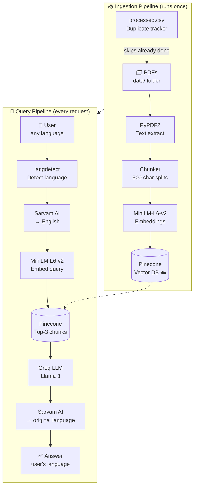

# 🚆 Indian Railway Passenger Rights Chatbot

A multilingual RAG-based chatbot that answers questions about Indian Railway passenger rights — refunds, cancellations, and delays — in **10+ Indian languages**.

---

## 🛠️ Tech Stack

| Layer | Tool |
|---|---|
| PDF Parsing | PyPDF2 |
| Vector Database | Pinecone |
| Embeddings | `all-MiniLM-L6-v2` |
| LLM | Groq (Llama 3) |
| Translation | Sarvam AI API |
| UI | Streamlit |

---

## 🏗️ Architecture



> **Two pipelines:** Ingestion runs once on startup (or when new PDFs are added). The query pipeline runs on every user message.

---

## 📁 Project Structure

```
project/
├── data/              ← Put your Railway PDFs here
├── app/
│   ├── ingest.py      ← PDF → chunks → Pinecone
│   └── rag.py         ← Retrieve → Groq → Translate
├── config.py          ← API keys & settings
├── main.py            ← Streamlit app (run this)
├── requirements.txt
├── processed.csv      ← Auto-created, tracks ingested PDFs
└── .env               ← Your API keys (create from .env.example)
```

---

## ⚙️ Running Locally

### Step 1 — Clone the repo

```bash
git clone https://github.com/your-username/railway-chatbot.git
cd railway-chatbot
```

### Step 2 — Create a virtual environment

```bash
python -m venv venv

# Mac / Linux
source venv/bin/activate

# Windows
venv\Scripts\activate
```

### Step 3 — Install dependencies

```bash
pip install -r requirements.txt
```

### Step 4 — Set up your `.env` file

Copy the example file:

```bash
cp .env.example .env
```

Open `.env` and fill in your keys:

```env
GROQ_API_KEY=your_groq_key_here
SARVAM_API_KEY=your_sarvam_key_here
PINECONE_API_KEY=your_pinecone_key_here
```

> All three keys are **free**. Get them here:
> - 🔑 Groq → [console.groq.com](https://console.groq.com)
> - 🔑 Sarvam AI → [dashboard.sarvam.ai](https://dashboard.sarvam.ai)
> - 🔑 Pinecone → [app.pinecone.io](https://app.pinecone.io)

Then add this to the top of `config.py` to load the `.env` file:

```python
from dotenv import load_dotenv
load_dotenv()
```

And install dotenv:

```bash
pip install python-dotenv
```

### Step 5 — Add your PDFs

Drop your Indian Railway rule PDFs into the `data/` folder:

```
data/
├── refund_rules.pdf
├── passenger_charter.pdf
└── cancellation_policy.pdf
```

### Step 6 — Run the app

```bash
streamlit run main.py
```

App opens at **http://localhost:8501** ✅

> On first run, PDFs are automatically ingested into Pinecone. This takes ~1-2 minutes depending on PDF size. All subsequent runs are instant.

---

## 🌐 Deploy to Streamlit Cloud (Free Public URL)

1. Push your project to GitHub *(don't commit `.env`!)*
2. Go to [share.streamlit.io](https://share.streamlit.io) → **New app**
3. Connect your repo, set entry point to `main.py`
4. Add your secrets under **Settings → Secrets**:

```toml
GROQ_API_KEY = "gsk_..."
SARVAM_API_KEY = "your_key"
PINECONE_API_KEY = "your_key"
```

5. Click **Deploy** → get a public URL like `https://yourname-railway-bot.streamlit.app`

---

## ✅ Sample Queries to Try

Once the app is running, test it with these queries:

**English**
```
Can I board the train from a different station than my booked one?
```

**Hindi** _(Can I transfer my ticket to someone else?)_
```
क्या मैं अपना टिकट किसी दूसरे व्यक्ति को ट्रांसफर कर सकता हूँ?
```

**Marathi** _(If my train is cancelled, how do I get a refund?)_
```
माझी ट्रेन रद्द झाली तर मला परतावा कसा मिळेल?
```

---

## ❗ Common Errors & Fixes

| Error | Fix |
|---|---|
| `No PDFs found in data/` | Add at least one `.pdf` file to the `data/` folder |
| `Pinecone index not found` | Check your `PINECONE_API_KEY` in `.env` |
| `401 Unauthorized` (Groq) | Check your `GROQ_API_KEY` in `.env` |
| `ModuleNotFoundError` | Run `pip install -r requirements.txt` again |
| Translation not working | Check your `SARVAM_API_KEY` in `.env` |

---

## 📝 Notes

- `processed.csv` is auto-created to track which PDFs have been ingested — **don't delete it** or PDFs will be re-processed
- Add `processed.csv` to `.gitignore` if you want a clean re-ingestion on each deployment
- The Pinecone free tier supports **1 index** with up to 100K vectors — more than enough for railway PDFs
